# HackTheBox Writeup : Cap

**Disclaimer : 
This writeup is for educational purpose only.
Do not use these techniques on systems you do not own or do not have explicit authorization to test.
I am not responsible for any misuse of the information provided here.**

## Overview

Overpass is a **HackTheBox retired machine**, the level is marked as easy. I needed about an hour to complete the machine.

The machine is available at https://app.hackthebox.com/machines/Cap

## Step 1 : Enumeration

We start by enumerating the machine with an nmap scan, looking for open ports and common services they correspond to.

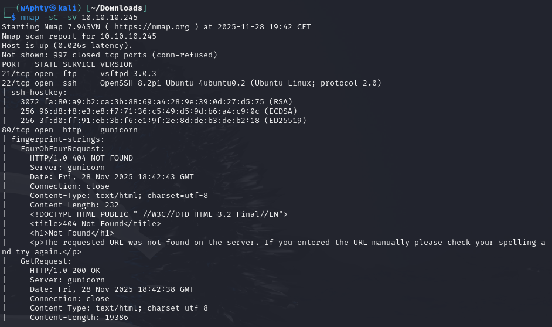

We can see an ftp server running on port 21, ssh on port 22 and a web server on port 80. To check if there are any other services running on less commonly used ports, we can run the following:

```bash
$ nmap -p- -Pn -n 10.10.10.245
```

In this case, the result shows the same 3 open ports as previously, so now we can move on to enumerating these services.

The anonymous login on the ftp server does not work, so we will get back to it later if we find potential credentials : 

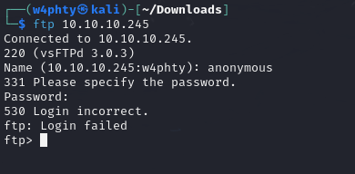

Browsing to the web service, we land on a dashboard, where we are logged in as the user Nathan.

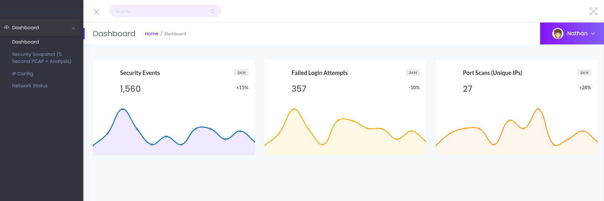

From here, we can see 3 main features : a pcap capture, an ip config page and a network status page.

Seeing that the result of the ip config page looks a lot like the result of the OS Command ifconfig, we can try and intercet the request with Burp to check if we can find some parameter containing an OS command in the request, that could be exploited.

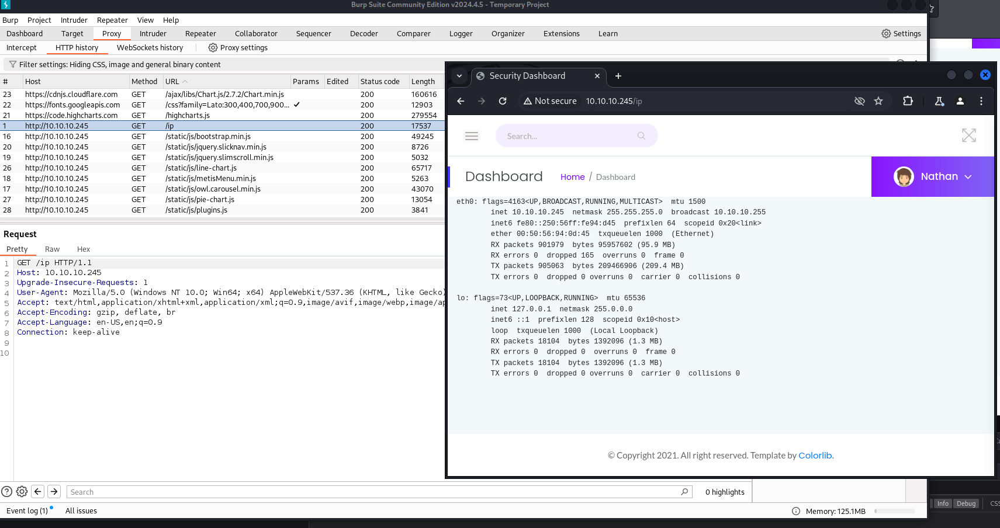

Since there are no interesting parameters in the requests, we can get back to the other features. 

The PCAP analysis apparently captures the traffic for 5 seconds, and then you can download the pcap file, and analyze its content using Wireshark.

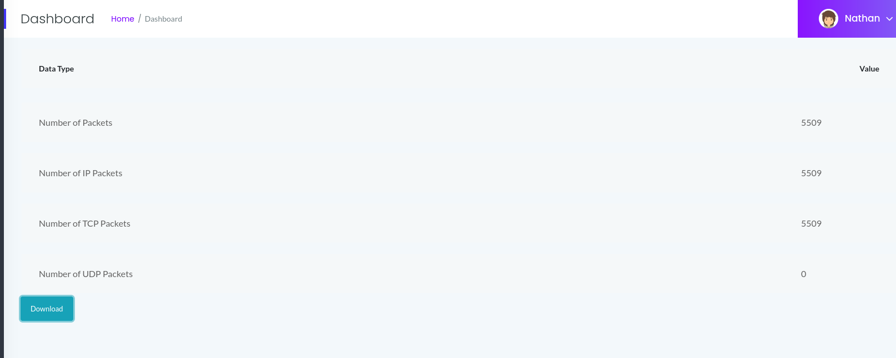

So after launching an analysis and opening it with Wireshark, we can see the packets captured, which correspond to the activity we generated on the website in the meantime, but no other interesting data can be seen.

However, we can notice the URI parameter of our PCAP capture was something like /data/13 : this means other captures were made before ours.
We can change the URI value to different values, I first tried with 0 since this would have been the first capture done.

Opening the downloaded pcap file, we get the following packets :

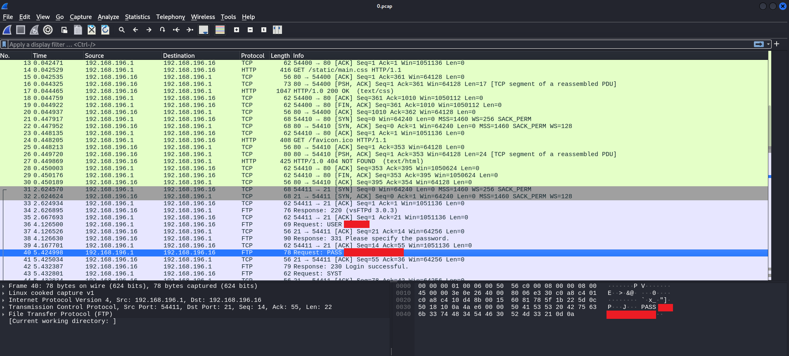

We can notice some FTP packets, showing a user logging in to the FTP server!

We can now get back to the ftp server, and login with the credentials we just found.

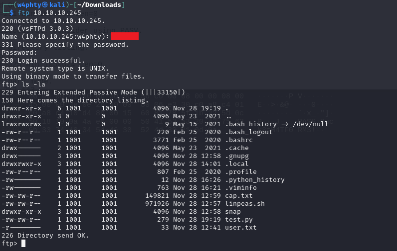


## Step 2 : Compromising the user account


The content of the ftp server looks a lot like the home directory of the user. We can try retrieving files and reading them. 
I also tried looking for the user ssh private key but did not find it here.

Another thing we can think of at this point is credential reuse.
And indeed, the ssh login with these credentials is successfull : 

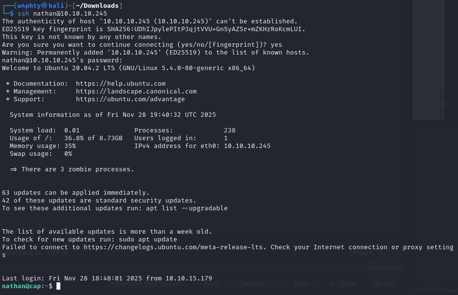

From here we can read the user flag : 

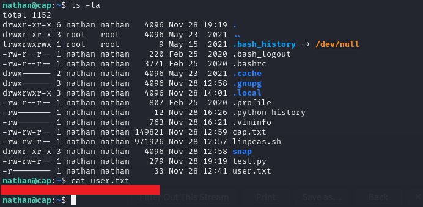


## Step 3 : Privilege escalation

There is another text file in the directory. When opening it, we realize it is a report for a LinPeas script, which checks for vulnerabilities that can be used in order to escalate privileges.

Reading through this document, we can find that a specific version of a python binary has Capabilities enabled, which means that running a python script with this binary would give the script the same capabilities as the binary.

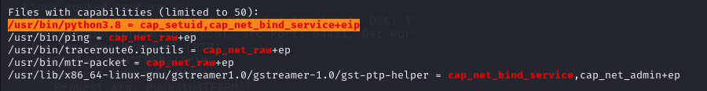

In the user home directory, there is also a python script, that apparently tries to set the uid of the user to 0, meaning it tries to elevate the privileges of the current user to root.

Running this test.py script using the specific python binaries that has capabilities, we get the following result : 

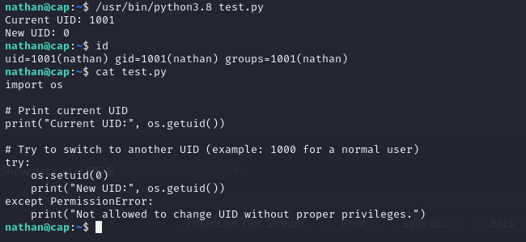

So we successfully changed our uid to 0, but only within the script's scope. 
We can add a line in the python script that will spawn a shell after setting the uid to 0, in order to gain a shell with the elevated privileges.


And after running the script again, we get a shell as root!