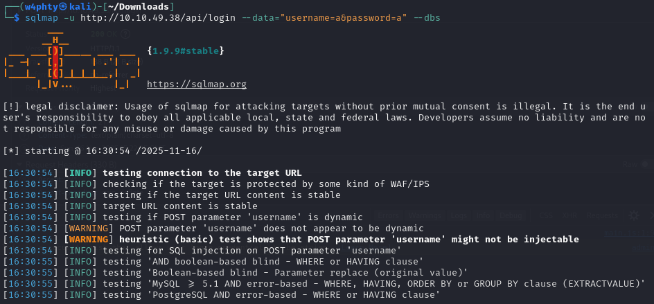
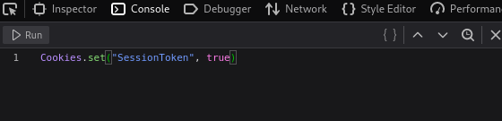
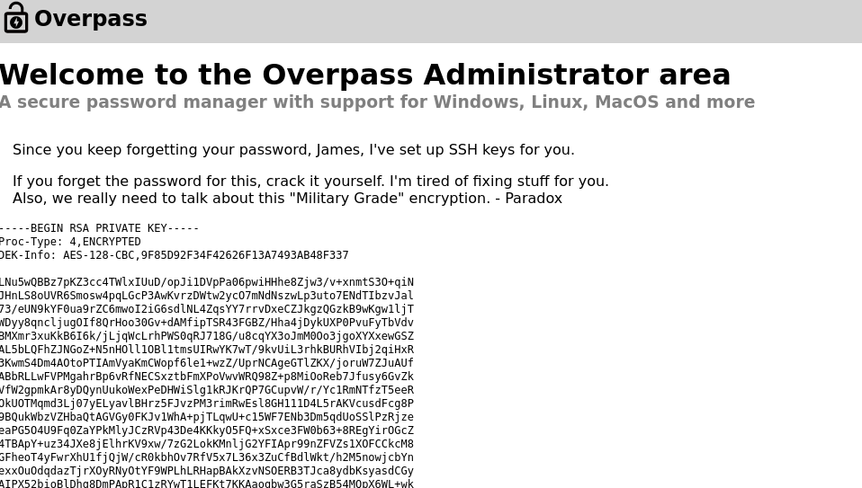
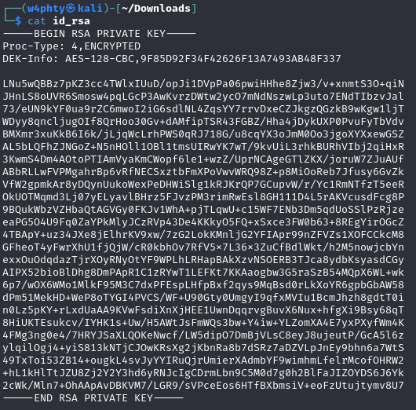
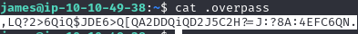
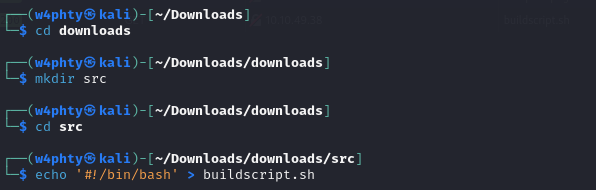
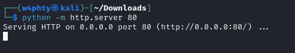
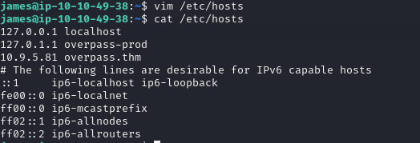
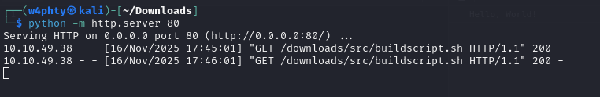
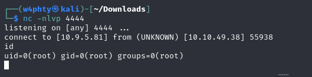

# THM Writeup : Overpass

## Overview

Overpass is a THM machine, the level is marked as easy.
The estimated time to complete the machine is 45 minutes, I needed about an hour.

The machine is available at https://tryhackme.com/room/overpass

## Step 1 : Enumeration

First, we can start with a scan of the most common ports :

We can also run another nmap scan to see if less common ports were being used to run other services, but we get the same results, with ssh and http as the only services up :

Checking the website, we land on the following page :

I looked around to see if I could find some interesting info, checked the available directories and the source code. 
The 'About' page lists some people related to the website, so I thought this could be used as a user wordlist later.

At this point, we can run a directory scan with gobuster :

In the results, we can spot an intersting directory : '/admin'

Back in the browser, the /admin directory is a login page :

## Step 2 : Compromise the web service

From this point, my first thought to bypass the login form was to try and bruteforce it using hydra, with a user wordlist made of the names found earlier, in the 'About' directory.

The user wordlist that I used is the following :

Then, while running hydra, I realized this would take way too long since I was not even sure about the spelling of the usernames:

I stopped hydra, since this was probably not the correct way to bypass the login form, and I tried running sqlmap to see if the username and password fields were vulnerable to some sort of SQL Injection.

The first attempt to run sqlmap failed. Looking back at the code in the login page, we can see that the data is actually redirected to another url for the login process : /api/login.
Once we realize this, we can run sqlmap again, with the correct url.

The results showed that none of the input parameters were vulnerable to SQL injections.

At this point, we have to go back in the browser and look for more information.
In the Debugger of the web browser, we can see that we have access to some javascript code. The login.js file is especially interesting.

In the login() function, we can see that if the submitted credentials are correct, a session token is added to the cookies. The value is statusOrCookie, but since we don't know what this value is supposed to be equal to, we can try with 'true'.

After running this in the console of the web browser, we can reload the /admin page to see if there have been any changes, and we can indeed see that we successfully bypassed the login form:

## Step 3 : Compromise the machine

Reading the content, we are able to recognize an RSA private key. We also get the name of the user to whom this key belongs.
We can copy the content of the key to a local file :

Then we set the correct rights on the id_rsa file, and try using it to connect to the user's account through ssh :

We are prompted for a passphrase!
Back to the id_rsa file, we can extract its hash value and crack it using John-The-Ripper.

Now we can login using ssh with the private key and the passphrase :

Connected as the user, we find our first flag :

## Step 4 : Privilege escalation

I started by enumerating files in the user directory, the content of the .overpass file catched my attention :

We can decode the content of the file using the website dcode.fr. Since there were many references to rot47 in the website, that is the first encoded method I tried.

The decoded file contains a password, we can try using it as james's password with the sudo -l command :

The password is indead james's, but he does not have any sudo rights.
We can enumerate the machine a bit further, looking for SUID permissions or cron files.

A command is being run every minute by the user root! 
The command ran is fetching an sh file from the webserver, and then executes it with bash.
First of all, we can navigate to the specified directory in the web browser, download the file and see what it contains.

I first tried to exploit the 'date' binary called in the sh file.
The goal is to create a fake date file that would be executed instead of the legitimate one.
To do this, we need to add the fake date file in a directory where bash will look before looking in the directory containing the legitimate date file.
The directories from $PATH are not writeable, so I decided to try anyway, adding the file in the user home directory and adding this directory at the beginnig of the PATH variable.

After waiting for a few minutes for the cron job to execute, we can see that this method does not work : the PATH variable used is the one set in /etc/crontab, which does not contain /home/james, making our fake date file not visible by bash when running echo "($date -R)".

After a while, I realized that the command curl overpass.thm/downloads/src/buildscript.sh can be exploited :)

Indeed, since curl calls a domain name and not the IP, if this domain name is specified in /etc/hosts, we can replace the IP by our own IP, and make the cron job retrieve a malicious file instead of the legitimate one.

To do this, we first need to check the permissions for /etc/hosts :

Then, we need to create a local directory on our attacker machine, that will contain the script that is being fetched :

Add the payload in the sh script :

And we also have to start a server on port 80 to make the file available :

The last thing we need to do is replace the IP for overpass.thm with our IP :

Now we setup a listener with netcat to receive the connection, and wait for the cron job to fetch the file, execute the payload and we should get a connection.

After a few seconds, we can see a call made on the server on our attacker machine : 

In the listener, we got a shell as root!

From here we can retrieve the final flag :)

