# TryHackMe Writeup : Road

**Disclaimer : 
This writeup is for educational purpose only.
Do not use these techniques on systems you do not own or do not have explicit authorization to test.
I am not responsible for any misuse of the information provided here.**

## Overview

Road is a TryHackMe machine, the level is marked as medium.
The estimated time to complete the machine is 60 minutes.

The machine is available at https://tryhackme.com/room/road

## Step 1 : Enumeration

As always, we can start the enumeration with an nmap scan of the machine.
With the first scan, we check for services versions of the most common ports.


From the first scan, we learn that the machine runs a web service and an ssh service.
Then we can run a second scan, to check if there are any other services running on the less commonly used ports :

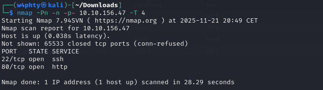

There are no other services running, so we can move on to enumerating the website hosted on the machine.Opening a web browser and navigating to the machine's IP, we get the following interface : 


I started enumerating manually the website, checking the features and source code. We quickly find a login form : 

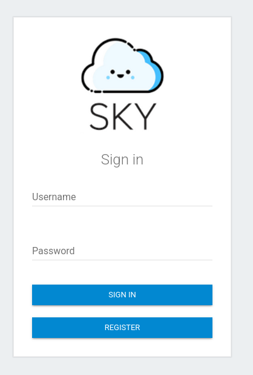

In the meantime, we can try and run a directory enumeration with Gobuster : 

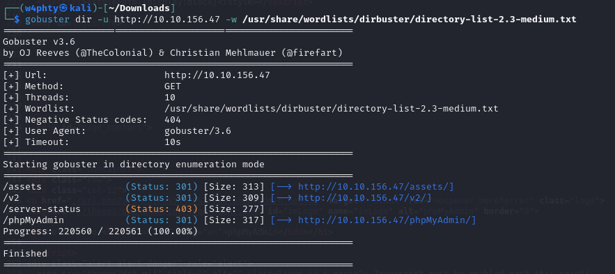

The directory returned here are not actually useful : I tried the phpMyAdmin default credentials, without success.

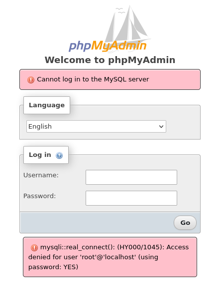

Back to the login form, we can register a user and login. After login, we access the dashboard.

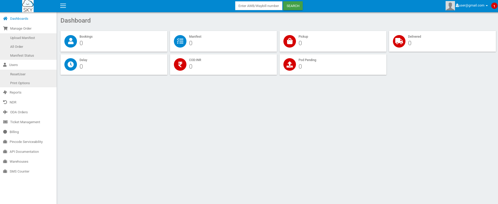

From the dashboard, we can find a profile page that contains a function to upload a new profile image. This could be a good place to try and get a reverse shell. 

However, this feature is only available for the admin user.


We continue enumerating the website, we can find a reset password function, that could potentially be exploited to reset the admin password.


## Step 2 : Getting admin access to the web dashboard

The reset password function made me think about an IDOR vulnerability :
- the username can not be modified manually but appears in the form, and can probably be modified when intercepting the request
- we are not required to provide the current password to reset it, so not knowing the admin's current password is not a problem
- we know the admin's username : the email found below the upload profile image feature


Using Burpsuite, we send a reset password request as the current user, and intercept the request.

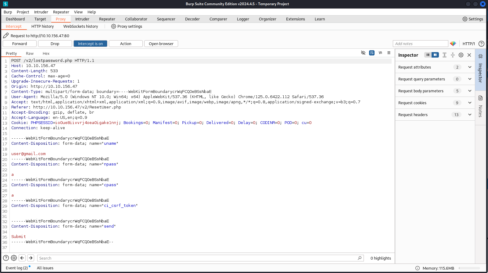

The username is sent with the new password as parameters in the POST request! We can modify the username to the admin email found earlier, and forward the request.


After forwarding the request, we can see a 200 answer code and a message indicating that the password was successfully changed.

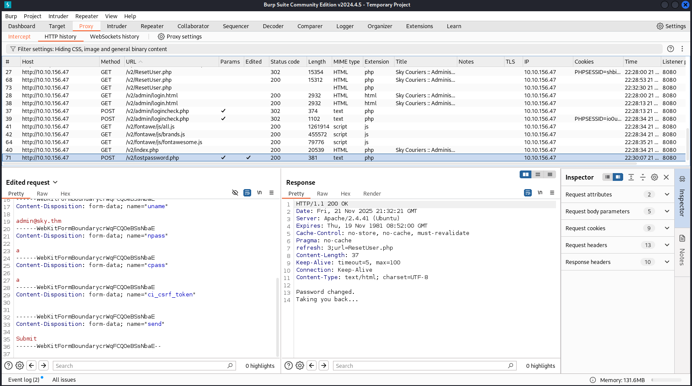

We can now try and login to the dashboard as admin, using the password we chose in the reset function :

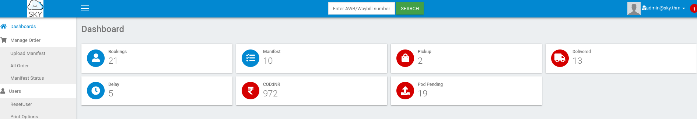

## Step 3 : Getting a shell

Now that we are admin, we have access to the update profile image feature.

First thing we need is creating the file that will be uploaded to the server.
To do this, I used the php reverse shell from https://github.com/pentestmonkey/php-reverse-shell
and changed the IP and port.

Then we can upload the file to the server :


After this, we set up a listener, I used netcat for this :

``` bash
$ nc -nlvp 1234
```

Now we need to make the server run the shell code from the profile image. I thought reloading the page would work but it did not.

After a while, I finally found a directory commented in the source code of the profile page :
```
<!-- /v2/profileimages/ -->
```

Navigating to this directory, we get the following message : 

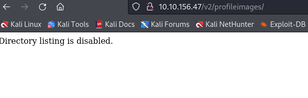

So we can try navigating to /v2/profileimages/shell.php, and we get a shell!


## Step 4 : Privilege escalation - Part 1

Now that we get a shell, we can enumerate the machine from within. I started by checking the existing users, turns out we can access the first flag without being authenticated as the user 'webdeveloper'!

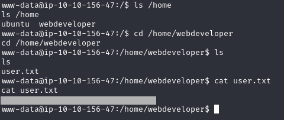

Then we can use automated enumeration tools like LinEnum to get more information: 

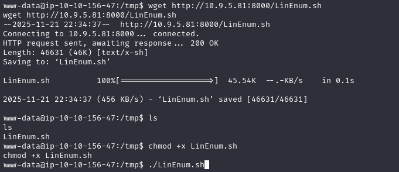

Running LinEnum.sh, we find out that other services are running on the machine, especially a MySQL database on port 3306, and a MongoDB database on port 27017.


The mysql service probably requires a username and password. However, we can see by checking the file /etc/mongod.conf that the security part is commented out. This probably means that we can try and log into the mongodb service without authentication!


From here we can retrieve databases, tables and their content : 

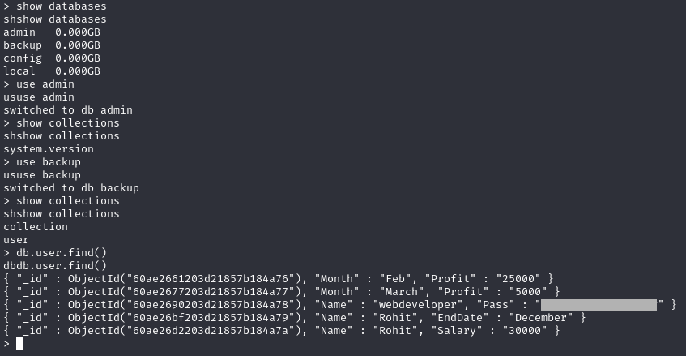

And now we got webdeveloper's password ! We can use it to login as webdeveloper.

## Step 5 : Privilege escalation - Part 2

First thing I usually do is checking for sudo rights :

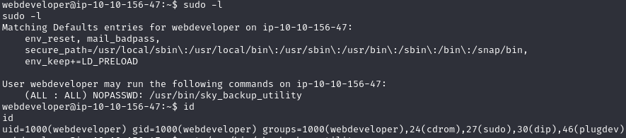

Here we get something interesting : the env_keep += LD_PRELOAD allows us to load a shared librarie in front of all the others through the LD_PRELOAD environment variable.

We can exploit this by crafting a shared library from a .c file, and load it with LD_PRELOAD when running sudo.

You can find more info about this exploit here : https://www.hackingarticles.in/linux-privilege-escalation-using-ld_preload/

The first step is to create the C payload : 


Then we transfer the payload to the target, and run the following to create the shared librarie :

``` bash
$ gcc -fPIC -shared -o shell.c shell.so -nostartfiles
```

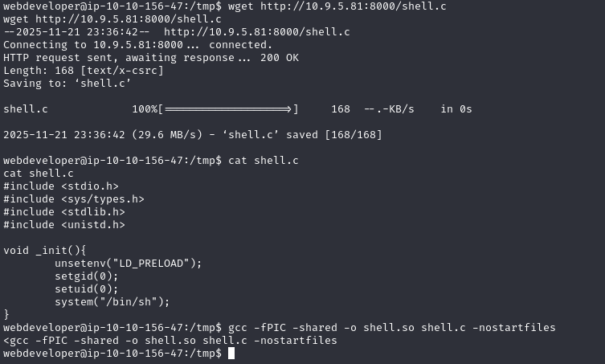

The last thing we need to do is running sudo loading the shared librarie we created :

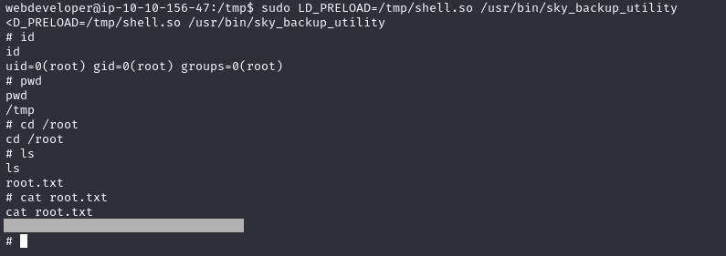

And we get a shell as root! 