# TryHackMe Writeup : SoupeDeCode 01

**Disclaimer : 
This writeup is for educational purposes only.
Do not use these techniques on systems you do not own or do not have explicit authorization to test.
I am not responsible for any misuse of the information provided here.**

## Overview

Soupedecode 01 is a Windows machine available on TryHackMe, marked as Easy.
In this room, we will encouter SMB shares, Kerberos authentification and pass-the-hash attack. 

The room is available here : https://tryhackme.com/room/soupedecode01

## Step 1 : Enumerate the machine

We begin by running an Nmap scan. Since the room description indicates that the target is a Windows machine, it’s likely that ICMP echo requests will be blocked. Because of this, Nmap’s default host-discovery stage might incorrectly treat the host as offline. To avoid this, we can use the -Pn option, which skips host discovery and proceeds directly to scanning the ports.

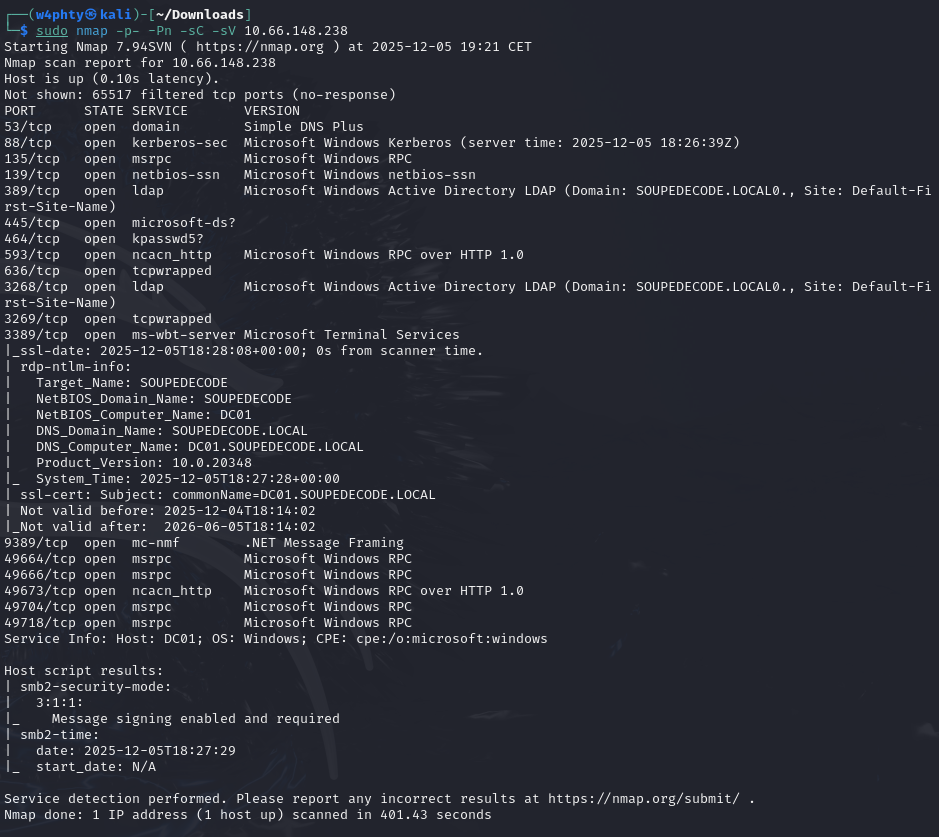

The Nmap script output confirms that the target is a Windows machine. We can see some SMB shares available, so the next step is to list the shares, using smbclient.

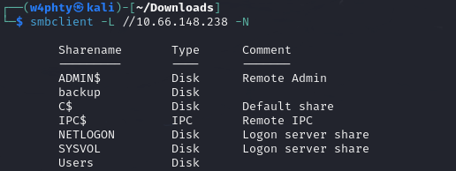

We can try connecting to the available shares, but it seems that we are unable to read their content : 

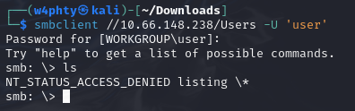

## Step 2 : User enumeration

To get a more complete access to the smb shares, we need to find working credentials. 
To achieve this, we will perform Remote Identifier (RID) bruteforce attack, using metasploit.
After starting metasploit, type the following to use the RID scanner : 

```bash
$ msfconsole
[...]
> use auxiliary/scanner/smb/smb_lookupsid
> set RHOSTS 10.66.148.238
> set smbuser guest
> run
```

Once the scanner completes, we get a list of usernames and RIDs : 

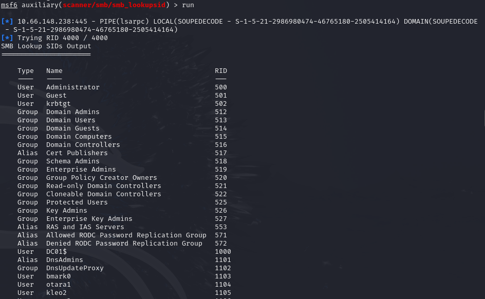

We can use awk to extract only the usernames :

```
$ awk '{print $2}' metasploit_results.txt > users.txt
```

## Step 3 : Exploitation

Now we can attempt to brute-force SMB access using the usernames we discovered earlier, reusing the same wordlist for passwords. It’s possible that one of the accounts may have a password identical to their username.

To run the brute-force attack, we can use the tool netexec. On my setup, I needed to install it manually with pip inside a Python virtual environment.

Below is how to install netexec using a Python venv:
``` 
$ python3 -m venv .venv
$ source .venv/bin/activate
$ pip install netxec
```

Once we have netexec properly running, we can launch the brute-force attack : 

``` 
$ nxc smb 10.66.148.238 -u users.txt -p users.txt --no-brute --continue-on-success
```

And we successfully obtain valid credentials!

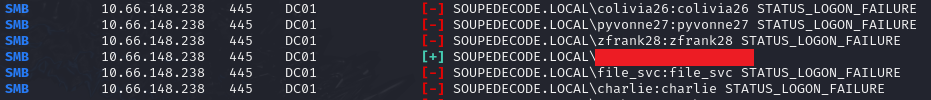

We can try logging in to the Users smb share with the username / password we just found:

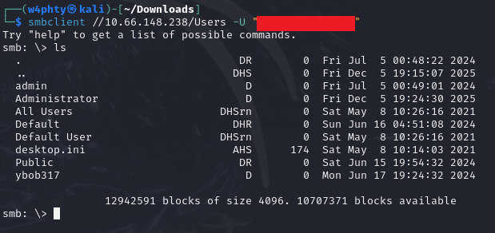

While enumerating the content of the share, we can find the first flag.

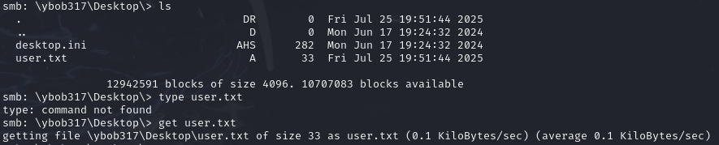


## Step 4 : Privilege Escalation

Now that we have valid low-privileged credentials, we can use them to authenticate to the domain and run impacket-GetUserSPNs. This allows us to enumerate users with registered Service Principal Names (SPNs) and retrieve the corresponding Kerberos TGS ticket hashes.

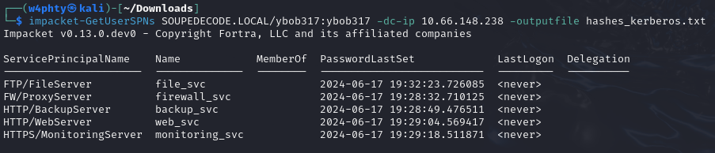

We now have a file containing kerberos TGS hashes, which we can attempt to crack using Hashcat :

```
$ hashcat -m 13100 hashes_kerberos.txt /usr/share/wordlists/rockyou.txt
```

We obtain a password!

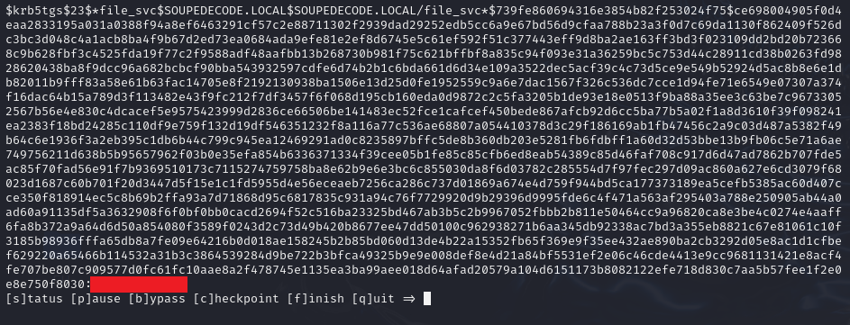

 We use the new credentials to authenticate to the backup smb share :

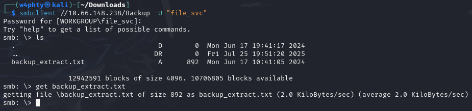

In the backup share, we find a back_extract.txt file. When opening this file we see that it contains NTLM hashes.

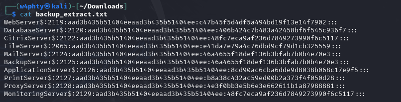

We can extract a user list and a hash list from the backup file :

```
$ awk -F\: '{print $1}' backup_extract.txt > usernames.txt
$ awk -F\: '{print $4}' backup_extract.txt > ntlm_hashes.txt
```

Now we use the NTLM hashes and usernames to perform a Pass-the-hash attack. Using netexec, we attempt to identify a valid hash-to-user pairing.

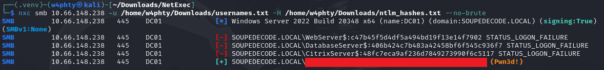

With the valid hash we identified, we can obtain a shell on the target machine :

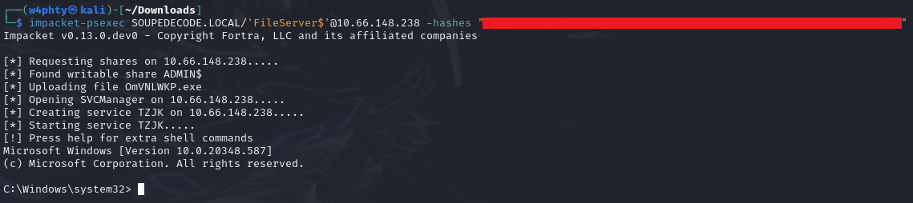

And finally, we get the root flag!

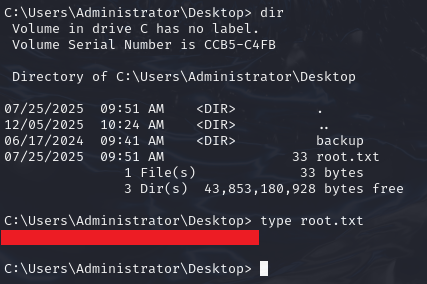

